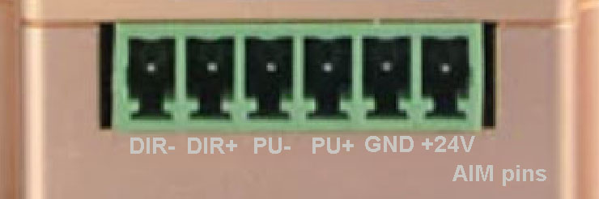
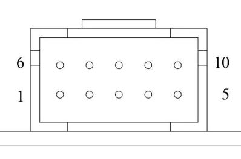

# OSSM-RS

> [!WARNING]
> While this firmware should be safe and stable, its largely monolithic architecture makes it more difficult to develop modular patterns and features
>
> [@nakatanakamoto](https://github.com/nakatanakamoto/) made a firmware that is largely based on the code of firmware,
> but with significant improvements in terms of abstractions and ergonomics.
>
> All the new feature development will be done in the new [ossm](https://github.com/ossm-rs/ossm) repository.
>
> This repository is kept as historical reference, but if you see any huge safety issues please let me know and I will archive it or make targeted changes to fix those.

---

An alternative firmware for OSSM written in Rust

You can find the original hardware and software [here](https://github.com/KinkyMakers/OSSM-hardware/tree/master)

## Features

- Full RS485 based motor control
- Motor settings set automatically
- S-curve motion planning
- Strict mechanical bounds checks
- Adjusting depth, velocity, and stroke start on the fly
- Off-the-shelf control board support
- Patterns

## Trying It Out

### Getting Ready

1. Install Rust using the instructions [here](https://rustup.rs)
  - Windows
    - Download and run [rustup-init](https://win.rustup.rs/x86_64)
    - Select "Quick install via the Visual Studio Community installer"
    - Select "Proceed with standard installation (default - just press enter)"
  - Linux or MacOS
    ```bash
    curl --proto '=https' --tlsv1.2 -sSf https://sh.rustup.rs | sh
    ```

2. Open a terminal

3. Install the ESP Rust toolchain for Xtensa devices as well as the `espflash` tool for flashing devices by running the following commands:
```bash
cargo install espup --locked
espup install
cargo install espflash --locked
```

More information can be found [here](https://docs.espressif.com/projects/rust/book/getting-started/toolchain.html#xtensa-devices)

### Compiling And Uploading

1. See the [supported boards](docs/supported_boards.md) section to see if your board is supported and use the feature flag in the next step

2. If on Linux or MacOS set the environment variables with:
```bash
. $HOME/export-esp.sh
```

3. Compile with and upload with:
```bash
cargo xtask run <board_name>
```

### First Boot

When you first start the machine it may appear that nothing is working.

Power cycle everything! Disconnect the motor power supply as well as the controller board for a few seconds and then reconnect everything.

This is necessary because the motor comes with a baudrate of 19200 from the factory.
This is very slow and on first boot OSSM-RS will change it to 115200 which requires the motor to be power cycled to take effect.

If you check the logs you should see: `Motor baudrate updated. Please power cycle the machine!`

### Developing OSSM-RS

### See [Developing OSSM-RS](docs/developing.md)

## Board Support

### See [supported boards](docs/supported_boards.md)

## Remote Support

- [M5 remote](https://github.com/ortlof/OSSM-M5-Remote)
- [OSSM BLE Protocol](https://github.com/KinkyMakers/OSSM-hardware/blob/master/Software/src/services/communication/BLE_Protocol.md)

## Motor Support

### 57AIMxx RS485

Connect a ~1500uF >50V capacitor between the power pins. 2200uF 63v was found to work well

Power pinout (motor shaft facing up):


Data pinout used for the diagrams (motor shaft facing down):


| Pin # | Function    | Description                                           |
|-------|-------------|-------------------------------------------------------|
| 1     | NC          |                                                       |
| 2     | RS485_A     | RS485 +                                               |
| 3     | RS485_B     | RS485 -                                               |
| 4     | NC          |                                                       |
| 5     | NC          |                                                       |
| 6     | COM         | Ground for RS485 and outputs                          |
| 7     | WR          | Alarm output (active low)                             |
| 8     | RDY/PF      | Encoder pulses                                        |
| 9     | ZO          | Encoder zero                                          |
| 10    | RS485_Power | 5V in the datasheet, but seems to take 3.3V just fine |

## Patterns

### Built-In Patterns

#### OSSM Patterns

These are designed to closely mimic the patterns provided by the stock OSSM firmware

- Simple
- TeasingPounding
- HalfHalf
- Deeper
- StopNGo

#### OSSM-RS Patterns

These are designed to take advantage of the features provided by OSSM-RS

- Torque


### Making Custom Patterns

The list of patterns is stored under `pattern/mod.rs`

The easiest way to create your own is to copy, rename and modify one of the existing patterns in the `pattern` directory.
Don't forget to add it to `pattern/mod.rs` as well.

For details see the documentation of the `Pattern` trait and the related structs (`PatternInput` and `PatternMove`)

## Roadmap

Open an issue if you want to see something added

- [x] Off-the-shelf control board support
- [x] Patterns
- [x] R&D wireless remote support
